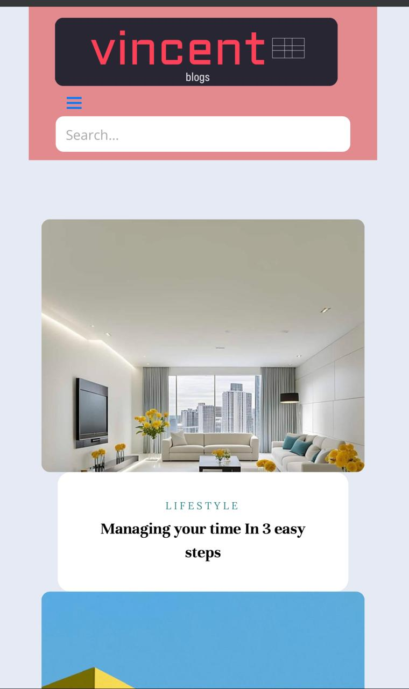
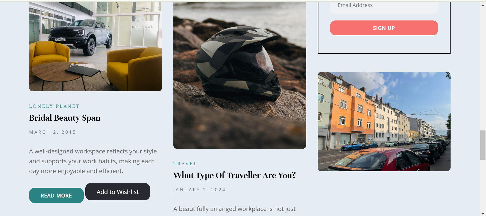

# Vincify Blog

A dynamic and responsive blog post website designed with modern UI/UX principles. This project showcases various blog posts, with a focus on a clean, user-friendly design that works seamlessly across both desktop and mobile devices.

## Table of Contents

- [Features](#features)
- [Technologies](#technologies)
- [Mobile View](#mobile-view)
- [Desktop View](#desktop-view)
- [Live Demo](#live-demo)
- [Installation](#installation)
- [Usage](#usage)
- [Contributing](#contributing)
- [License](#license)

## Features

- Responsive design for both mobile and desktop.
- Navigation bar with toggle functionality for mobile devices.
- Newsletter subscription form.
- Quick links and footer with social media integration.
- Mobile-friendly and cross-browser compatible.

## Technologies

- HTML5
- CSS3 (Bootstrap)
- JavaScript (jQuery)
- [Slick Carousel](https://kenwheeler.github.io/slick/)
- [Owl Carousel](https://owlcarousel2.github.io/OwlCarousel2/)
- Magnific Popup

## Mobile View

Here’s a preview of how the blog looks on mobile devices:


<video controls src="mobile.mp4" title="Video Demo"></video>

### Key Mobile Features:
- Collapsible navigation menu.
- Optimized font and image sizes for mobile screens.
- Fully functional contact form.
  
## Desktop View

Here’s a preview of how the blog looks on desktop:


               (images/image1.png)

### Key Desktop Features:
- Full-width layout for better content display.
- High-quality images and typography for an engaging reading experience.

## Live Demo

Check out the live demo of the blog [here]https://vincified.netlify.app/.

## Installation

To get a local copy up and running, follow these steps:

1. Clone the repository:

   ```bash
   git clone https://github.com/VincentAgunda/themed_blog
